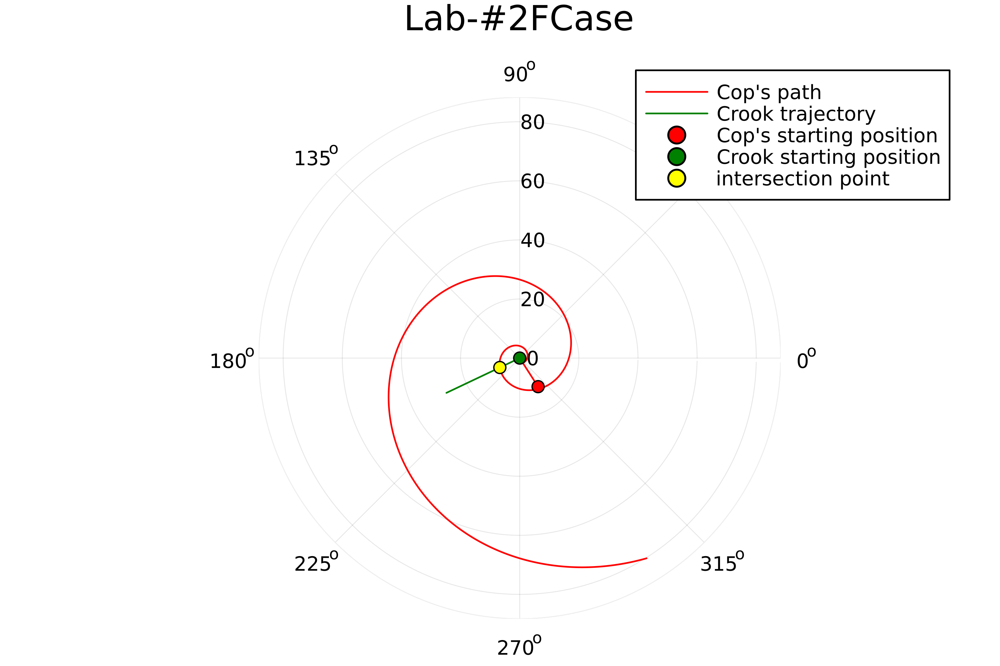
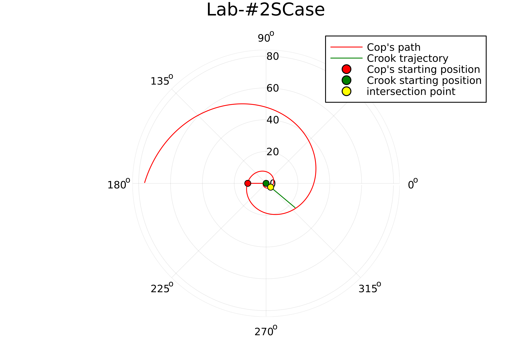

---
## Front matter
title: "Презентация по лабораторной работе №2"
subtitle: "НКНбд-01-21"
author: "Подлесный Иван Сергеевич"

## Generic otions
lang: ru-RU

## Formatting
toc: false
slide_level: 2
theme: metropolis
header-includes: 
 - \metroset{progressbar=frametitle,sectionpage=progressbar,numbering=fraction}
 - '\makeatletter'
 - '\beamer@ignorenonframefalse'
 - '\makeatother'
aspectratio: 43
section-titles: true
---

# Введение

## Ход Работы ч.1

1. Вычислили расстояние между лодкой (браконьеров) и катером (охрана), используя формулу $\frac{x}{\nu} = \frac{s \pm  x}{k*\nu}$, где s = начальное расстояние между лодкой и катером равный 11.5 км и k = коэффициент во сколько раз скорость катера выше чем скорость лодки. В итоге получили значения $x_1 = \frac{11.5}{4.5}$ и $x_2 = \frac{11.5}{2.5}$

2. Полагая, что катер береговой охраны окажется на одном расстоянии от полюса, что и лодка, он должен сменить прямолинейную траекторию и
начать двигаться вокруг полюса удаляясь от него со скоростью лодки $\nu$. Для этого скорость катера раскладываем на две составляющие: $\nu_r$ - радиальная скорость и $\nu_t$ - тангенциальная скорость. $\nu_r = \frac{dr}{dt}$. Нам нужно, чтобы эта скорость была равна скорости лодки, поэтому полагаем $\frac{dr}{dt} = \nu$. Тангенциальная скорость – это линейная скорость вращения катера относительно полюса. Она равна произведению угловой скорости $\frac{d\theta}{dt}$ на радиус, то есть $\nu_t = r \frac{d\theta}{dt}$. 

## Ход Работы ч.2

2. Отсюда, используя теорему Пифагора находим $\nu_t$, которая равна $\sqrt{(k*\nu)^2 - \nu^2}$. В данном варианте получаем $\nu_t = \sqrt{11.25} \nu$.

3. Решение исходной задачи сводится к решению системы из двух дифференциальных уравнений $\left\{ \begin{array}{cl} \frac{d\nu}{dt} = \nu \\r\frac{d\theta}{dt} = \sqrt{11.25}\nu \end{array}\right.$. После интегрирования получаем r = $C e^{\frac{\theta}{\sqrt{11.25}}}$

4. Переписали в julia.

5. Получили результаты в виде графиков.

## Итоговые графики ч.1

6. Результат случая s + x (рис. [-@fig:001])

{ #fig:001 width=50% }

## Итоговые графики ч.2

7. Результат случая s - x (рис. [-@fig:002])

{ #fig:002 width=50% }

# Результат