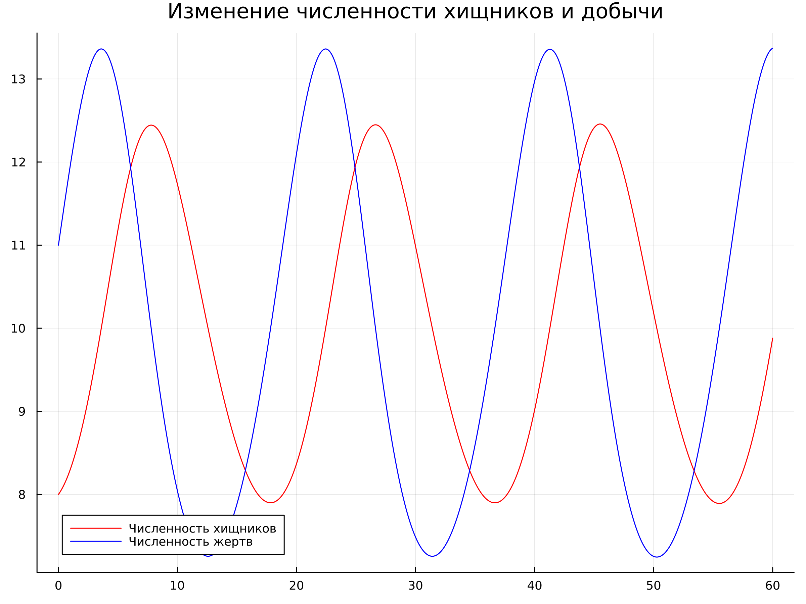
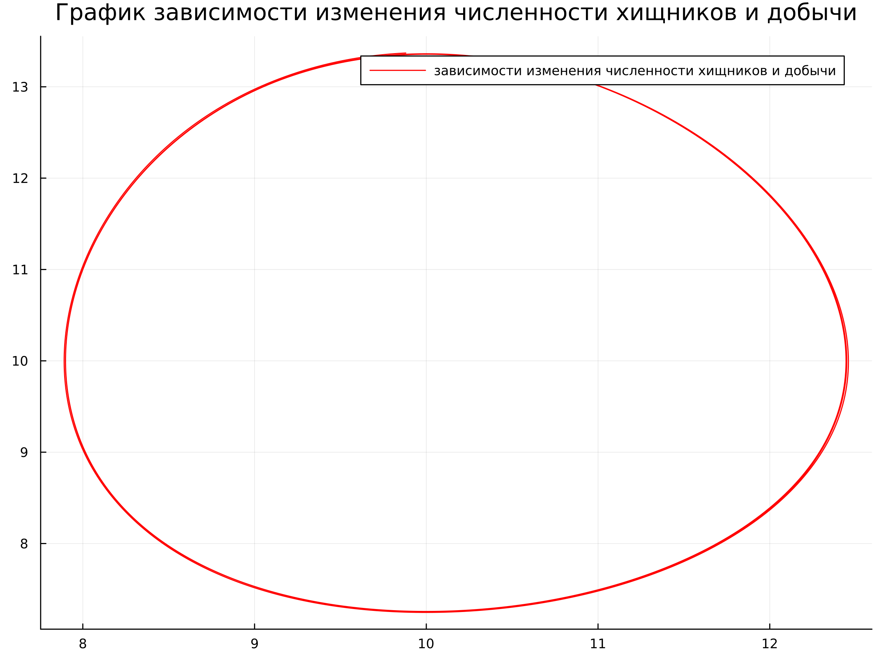
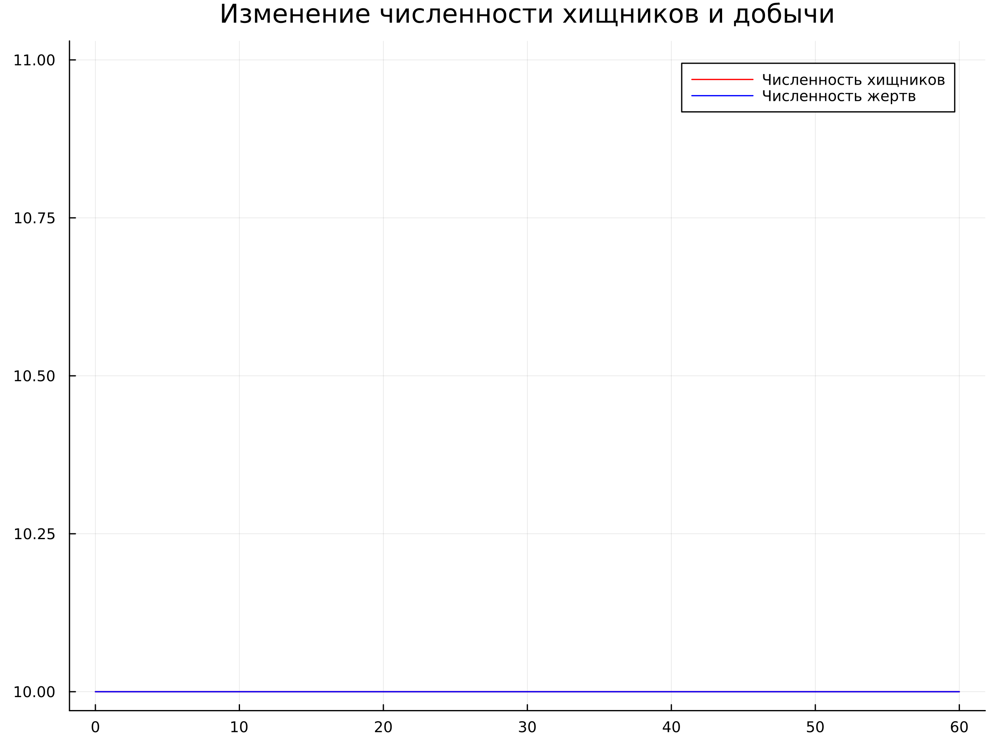
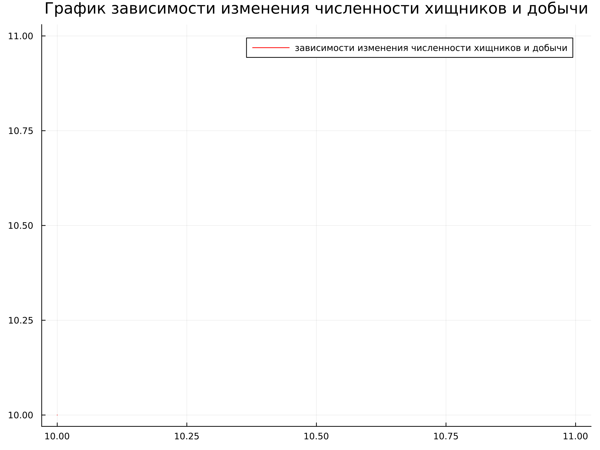

---
## Front matter
title: "Презентация по лабораторной работе №5"
subtitle: "НКНбд-01-21"
author: " Подлесный Иван Сергеевич"

## Generic otions
lang: ru-RU

## Formatting
toc: false
slide_level: 2
theme: metropolis
header-includes: 
 - \metroset{progressbar=frametitle,sectionpage=progressbar,numbering=fraction}
 - '\makeatletter'
 - '\beamer@ignorenonframefalse'
 - '\makeatother'
aspectratio: 43
section-titles: true
---

# Задание

## Ход Работы 

Вариант №32

$\begin{cases}\frac{\text{d}x}{\text{d}t}=-0.25x(t)+0.025x(t)y(y)\\\frac{\text{d}y}{\text{d}t}=0.45y(t)-0.045x(t)y(t)\end{cases}$$

Постройте график зависимости численности хищников от численности жертв, а также графики изменения численности хищников и численности жертв при следующих начальных условиях: $x_{0} = 8, y_{0} = 11$. Найдите стационарное состояние системы.  

## Теория для решения

   Простейшая модель взаимодействия двух видов типа «хищник — жертва» - модель **Лотки-Вольтерры**. Данная двувидовая модель основывается на следующих предположениях: 

1. Численность популяции жертв x и хищников y зависят только от времени (модель не учитывает пространственное распределение популяции на занимаемой территории) 
2. В отсутствии взаимодействия численность видов изменяется по модели Мальтуса, при этом число жертв увеличивается, а число хищников падает 
3. Естественная смертность жертвы и естественная рождаемость хищника считаются несущественными
4. Эффект насыщения численности обеих популяций не учитывается 
5. Скорость роста численности жертв уменьшается пропорционально численности хищников

$$\begin{cases}\frac{\text{d}x}{\text{d}t}=ax(t)+bx(t)y(y)\\\frac{\text{d}y}{\text{d}t}=-cy(t)+dx(t)y(t)\end{cases}$$

В этой модели $x$ -- число жертв, $y$ -- число хищников. Коэффициент $a$ описывает скорость естественного прироста числа жертв в отсутствие хищников, $c$ -- естественное вымирание хищников, лишенных пищи в виде жертв.

## Итоговые графики

{#fig:001 width=70%}

## Итоговые графики

{#fig:002 width=70%}

## Итоговые графики

{#fig:003 width=70%}

## Итоговые графики

{#fig:004 width=70%}

# Результат
Мы Построили фазовый портрет гармонического осциллятора и нашли решение уравнения гармонического осциллятора для заданных случаев 